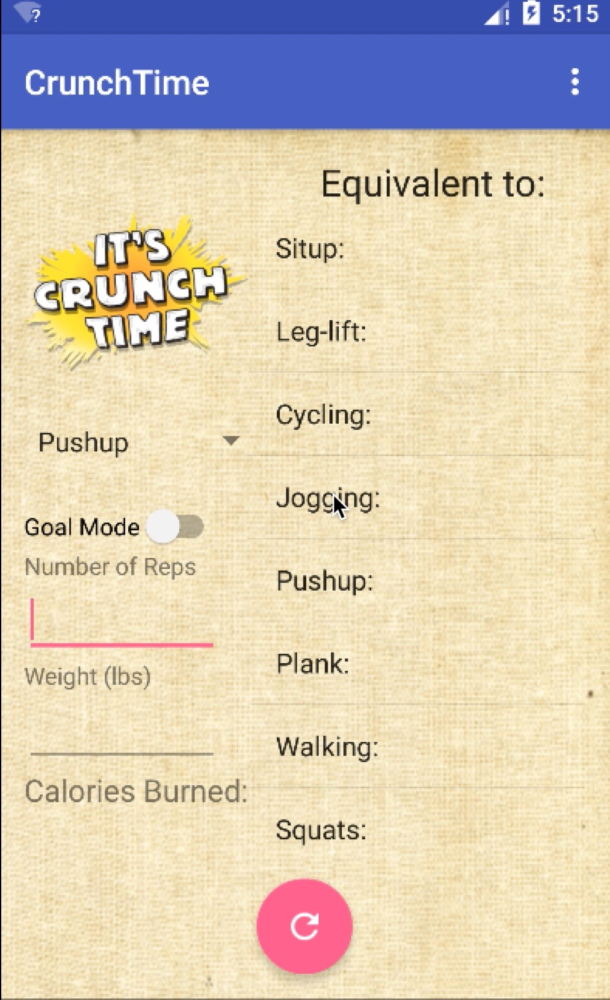

# PROG 01: Crunch Time

This Android application is meant to help people calculate the number of calories they burned and also compare with other exercises to help them make better fitness decisions.

## Authors

Vignesh Muruganantham ([muruvig@berkeley.edu](mailto:your_email@berkeley.edu))

## Demo Video

See [Crunch Time Demo] (https://youtu.be/dKG8ut00i4c)

## Screenshots

